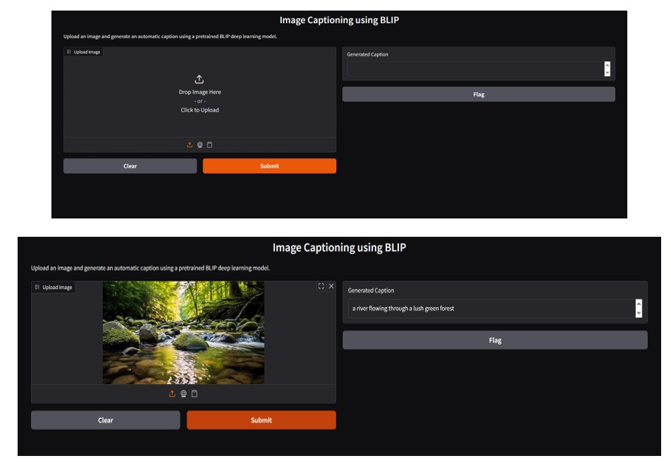
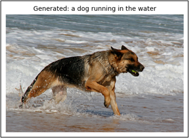
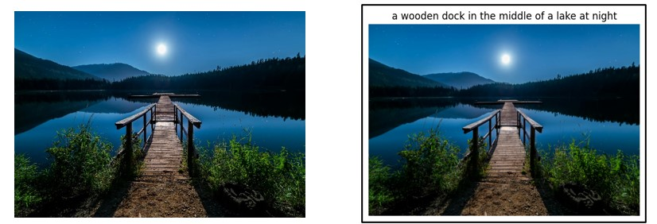

# Image Captioning Deep Learning System

An end-to-end deep learning system that analyzes visual input, extracts high-level semantic features using a Convolutional Neural Network (CNN), and generates natural language descriptive captions using a Recurrent Neural Network (LSTM).

## Features

* Automated visual feature extraction using a pre-trained CNN backbone
* Sequence generation pipeline using LSTM networks trained with word tokenization
* Greedy search and beam search decoding strategies for caption generation
* Interactive web-based user interface for uploading custom images and previewing captions
* Comprehensive Jupyter Notebook documenting data preprocessing, vocabulary building, and model training

## System Architecture

```text
Input Image
     ↓
CNN Feature Extractor (Encoder)
     ↓
Extracted Visual Features (Embedding)
     ↓
Tokenized Word Sequence (Decoder Context)
     ↓
LSTM Language Model
     ↓
Caption Prediction / Output Text
```


## Project Structure

```text
IMAGE-CAPTIONING-DEEP-LEARNING/
│
├── images/
│   ├── Block Diagram.png
│   ├── frontend.jpg
│   ├── Test1.png
│   ├── Test2.jpg
│   ├── DL_Proj_Image_1.jpg
│   ├── DL_Proj_Image_2.jpg
│   ├── DL_Proj_Image_3.jpg
│   └── DL_Proj_Image_4.jpg
│
├── notebook/
│   └── DL_Project.ipynb
│
├── .gitignore
├── README.md
└── requirements.txt
```

## Demo & Results

### Web Application Interface


### Sample Model Predictions
| Input Test Image | Generated Caption Output |
| :---: | :---: |
|  | Model-generated descriptive caption |
|  | Model-generated descriptive caption |

## Setup Instructions

### 1. Clone the repository

```bash
git clone [https://github.com/umerharoon890/image-captioning-deep-learning.git](https://github.com/umerharoon890/image-captioning-deep-learning.git)
cd image-captioning-deep-learning
```

### 2. Create a virtual environment

```bash
python -m venv .venv
```

### 3. Activate the virtual environment

For Windows PowerShell:

```powershell
.\.venv\Scripts\Activate.ps1
```

For macOS/Linux:

```bash
source .venv/bin/activate
```

### 4. Install dependencies

```bash
pip install -r requirements.txt
```

### 5. Run the Project

To inspect model training, evaluation, and tokenization:

```bash
jupyter notebook notebook/DL_Project.ipynb
```

To launch the web interface:

```bash
streamlit run app.py
```

## Why This Project Is Useful

Bridging computer vision and natural language processing is fundamental for accessibility tools, automated visual documentation, and media indexing. This project demonstrates how multimodal deep learning architectures extract representations from convolutional layers and map them directly to natural language syntax.
